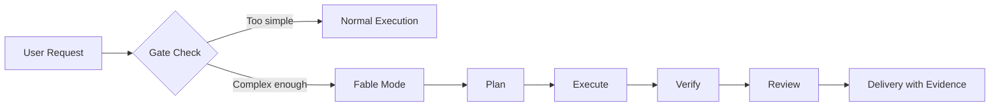
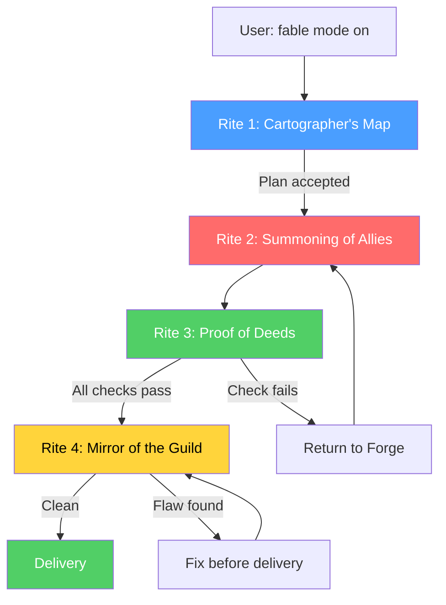
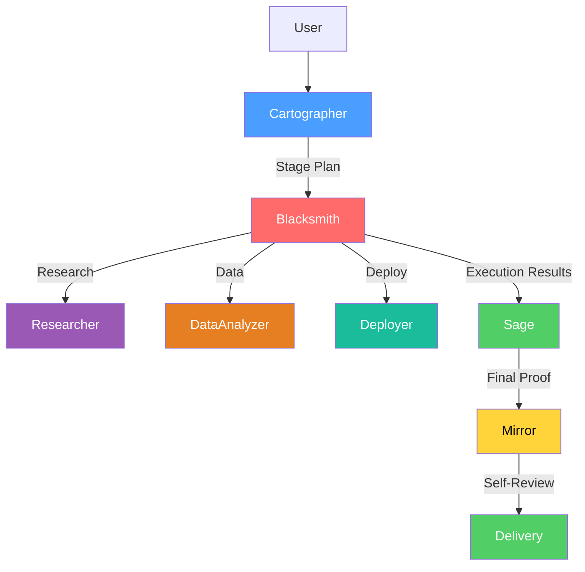
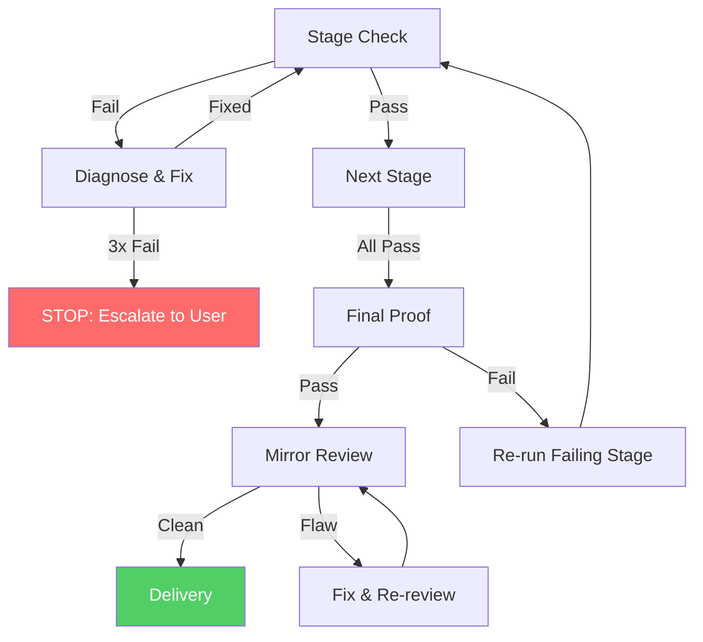

<p align="center">
  <br>
  
  
  
  
  <br>
</p>

<h1 align="center">Fable Mode</h1>

<p align="center">
  <strong>Staged execution discipline for AI agents.</strong>
</p>

<p align="center">
  Breaks complex work into stages with verifiable checks.<br>
  Requires proof before moving on. Runs a skeptical self-review.
</p>

---

## The Problem

AI agents are good at single-step tasks. Ask them to refactor 12 files, migrate an API, or write a research report and things break silently.

- Stages get skipped because "it should work"
- Tests are never actually run
- Regressions pile up undetected
- The agent delivers with confidence, but no evidence

Fable Mode makes the agent plan before acting, prove each stage before moving on, and review its own work before delivery.



---

## Features

| Feature | What It Does |
|---------|-------------|
| Gate Check | Refuses to activate on trivial tasks. No overhead where discipline isn't needed. |
| 3 Modes | `basic` (sequential), `full` (parallel delegation), `lite` (lightweight) |
| 7 Agents | Cartographer, Blacksmith, Sage, Mirror, Researcher, DataAnalyzer, Deployer |
| Stage Planning | Every task decomposed into stages with concrete outputs and verification checks |
| Verification Checks | Every check is a command that can pass or fail. No "looks good to me." |
| Vision Verification | Screenshot comparison, design fidelity, accessibility checks using Fable 5 vision |
| Self-Verification | Write-your-own-tests, reasoning re-derivation, output-against-goal |
| Dynamic Re-planning | Revise plans when evidence contradicts the hypothesis |
| Effort Control | Different thinking depth for different stages (high/xhigh for planning, medium for execution) |
| Fresh-Context Verification | Separate verifier subagent for final review |
| Progress Grounding | Every progress claim must cite tool evidence |
| Brevity Instructions | Prevent over-elaboration, lead with outcomes |
| Fallback Handling | Graceful degradation when Fable 5 refuses or fails |
| Structured Memory | Lessons learned, corrections, confirmed approaches across sessions |
| Long-Session Support | Checkpoint system, context compaction, session resume for multi-day tasks |
| Final Proof | Validates that all stages integrate and requirements are met before delivery |
| Self-Review | Mirror agent catches hidden complexity, assumptions, and weakened checks |
| Failure Paths | 12 documented failure scenarios with recovery strategies |
| Domain-Agnostic | Works for code, research, data, deployment, and visual tasks |

---

## Quick Start

Activate fable mode:
```
fable mode on -- refactor the authentication module across 5 files
```

What happens:

1. Gate check. Is this complex enough? Yes, proceed.
2. Cartographer decomposes into 5 stages with verification checks.
3. Blacksmith executes each stage, runs checks.
4. Sage validates the whole holds together.
5. Mirror runs a skeptical self-review before delivery.

The agent delivers with evidence, not confidence.

---

## Installation

Fable Mode is an [OpenCode](https://opencode.ai) skill. Copy the skill directory to your OpenCode skills folder:

```bash
# Clone the repository
git clone https://github.com/your-username/fable-mode.git

# Copy to OpenCode skills directory
cp -r fable-mode ~/.config/opencode/skills/fable-mode
```

Or install manually:

1. Download or clone this repository
2. Copy the `fable-mode/` directory to `~/.config/opencode/skills/`
3. Restart OpenCode

### Requirements

- OpenCode or Claude Code runtime
- Bash access for running verification checks
- Sub-agent support for `full` mode parallel delegation (optional)

---

## Usage

### Basic Mode (Default)

For multi-file tasks with sequential steps:

```
fable mode on -- add input validation to the registration form
```

The agent will:

1. Plan the work in stages
2. Execute each stage sequentially
3. Run verification checks after each stage
4. Produce a final proof and self-review

### Full Mode (Parallel)

For large tasks where stages can run concurrently:

```
fable mode full -- migrate our API from v1 to v2, touching 12 endpoints
```

Independent stages are dispatched in parallel using sub-agents.

### Lite Mode (Lightweight)

For moderate tasks with 2-4 steps:

```
fable mode lite -- refactor the utility functions in src/utils
```

Simplified pipeline: plan, execute, verify, deliver.

### Trigger Keywords

Fable mode activates when the user says:

- "fable mode" / "fable mode on"
- "Hero's Guild"
- "staged execution"
- "stage plan"
- "proof of deeds"
- "disciplined execution"

### When It Does NOT Trigger

| Scenario | Why |
|----------|-----|
| Single-file edit | Trivially verifiable in one step |
| Quick question | No stages to decompose |
| User declines | Respect the refusal |

---

## How It Works

### The 4 Rites



```
User: "fable mode on -- [task]"
     |
=== Rite the First: The Cartographer's Map ===
     |-> Decompose into stages with verification checks
     |-> User accepts plan
     |
=== Rite the Second: The Summoning of Allies ===
     |-> Execute stages (sequential or parallel)
     |
=== Rite the Third: The Proof of Deeds ===
     |-> Run verification check after each stage
     |-> Final Proof: does the whole hold together?
     |
=== Rite the Fourth: The Mirror of the Guild ===
     |-> Self-review: hidden complexity? assumptions? weakened checks?
     |
=== DELIVERY ===
     |-> Deliver with evidence, not confidence
```

### The Gate

Before fable mode activates, two conditions must be met:

1. The task cannot be done in one confident step. If it can, fable mode is overhead.
2. Discipline reduces failure risk. Not just pageantry.

### Verification Checks

Every stage must have a verification check that is:

- Concrete: a specific command (`pytest`, `npx tsc --noEmit`, `npm run lint`)
- Machine-verifiable: runs as a tool call, produces pass/fail output
- Honest: can genuinely fail. "Looks good" cannot fail honestly.

Good check:
```
pytest --tb=short → exits 0 with all tests passing
```

Bad check:
```
"Does the API response look correct?" → subjective, no evidence
```

---

## Agent Team

| Agent | Role | Active During |
|-------|------|---------------|
| Cartographer | Decomposes tasks into stages, defines verification checks | Rite the First |
| Blacksmith | Executes stages, runs checks, handles failures | Rite the Second + Third |
| Sage | Final Proof of Deeds. Validates integration and requirements. | Rite the Third (final) |
| Mirror | Self-review. Catches hidden complexity and process flaws. | Rite the Fourth |
| Researcher | Literature search, source verification, synthesis | When Blacksmith delegates research stages |
| DataAnalyzer | Schema validation, data integrity, edge cases | When Blacksmith delegates data stages |
| Deployer | Deployment checks, rollback, environment verification | When Blacksmith delegates deployment stages |

Each agent has a defined scope and cannot cross into another agent's territory.



---

## Project Structure

```
fable-mode/
├── SKILL.md                              # Core skill definition (450+ lines)
├── README.md                             # This file
│
├── agents/
│   ├── cartographer_agent.md             # Planning agent: stage decomposition + re-planning
│   ├── blacksmith_agent.md               # Execution agent: run stages & checks + self-verification
│   ├── sage_agent.md                     # Verification agent: Final Proof
│   ├── mirror_agent.md                  # Self-review agent: skeptical check
│   ├── researcher_agent.md              # Research specialist: sources, synthesis, contradictions
│   ├── data_analyzer_agent.md           # Data specialist: schema, integrity, edge cases
│   └── deployer_agent.md               # Deployment specialist: environment, rollback, smoke tests
│
├── references/
│   ├── check_types_by_domain.md          # Verification patterns (code/research/data/visual)
│   ├── gate_protocol.md                  # When to enter/exit fable mode
│   ├── failure_paths.md                  # 12 failure scenarios with recovery
│   ├── parallel_delegation_guide.md      # How to dispatch parallel stages
│   ├── verification_examples.md          # 20+ concrete check examples (including vision & self-verification)
│   ├── fallback_guide.md                 # Handling refusals and fallback mechanisms
│   ├── memory_system.md                  # Cross-session learning and memory structure
│   └── changelog.md                      # Version history
│
├── templates/
│   ├── stage_plan_template.md            # Fillable stage plan format (with checkpoint fields)
│   ├── final_proof_template.md           # Final proof checklist
│   └── delivery_summary_template.md      # Delivery summary format
│
└── examples/
    ├── multi_file_refactor.md            # Code refactor example (5 stages)
    ├── api_migration.md                  # API migration with parallel delegation
    └── research_project.md               # Research/writing project example
```

22 files. 4,000+ lines. 8 categories.

---

## What's New in v2.0

Fable Mode v2.0 leverages Claude Fable 5's capabilities for enhanced execution:

### 7 Agents (up from 4)

The Blacksmith now delegates to domain specialists:

| Specialist | Handles | Key Checks |
|------------|---------|------------|
| Researcher | Literature search, source verification | Source grading, contradiction detection, citation coverage |
| DataAnalyzer | Schema validation, integrity checks | Row counts, referential integrity, edge cases |
| Deployer | Deployment verification, rollback | Environment parity, smoke tests, health checks |

### Vision-Based Verification

Use Fable 5's vision capabilities to verify visual outputs:

- **Screenshot comparison**: Compare rendered UI against reference design
- **Design fidelity**: Verify component positions, colors, spacing
- **Responsive layout**: Test at multiple viewport sizes
- **Accessibility**: Check color contrast, keyboard navigation, ARIA labels

### Self-Verification

The Blacksmith can now verify its own work:

- **Write your own test**: After implementing, write a test that exercises the implementation
- **Reasoning re-derivation**: Solve twice independently, compare results
- **Output-against-goal**: Compare final output against original requirements
- **Code review**: Review own code as if reviewing a pull request

### Dynamic Re-planning

Plans are hypotheses, not sacred texts. When evidence contradicts the plan:

- **Repeated failure**: Stage fails 3 times with different fix attempts
- **New information**: Execution reveals something the plan didn't account for
- **User change**: Requirements shift mid-execution
- **Dependency issues**: Assumptions about dependencies prove wrong

### Long-Session Support

For tasks that span multiple days:

- **Checkpoint system**: Save progress after each stage passes
- **Context compaction**: Summarize completed stages to free context
- **Session resume**: Reconstruct state from checkpoint file
- **Memory integration**: Persist verified facts and user preferences across sessions

---

## What's New in v2.1

Fable Mode v2.1 deepens integration with Claude Fable 5's advanced capabilities:

### Effort Control

Use different thinking depths for different stages:

| Stage | Effort | Why |
|-------|--------|-----|
| Cartographer (planning) | `high` or `xhigh` | Planning requires deep reasoning |
| Blacksmith (execution) | `medium` or `high` | Execution needs good reasoning |
| Sage (verification) | `high` | Verification requires careful analysis |
| Mirror (self-review) | `xhigh` | Self-review benefits from deepest thinking |

### Fresh-Context Verification

Use a separate subagent with no prior context for final verification:
- Catches issues that same-context self-review misses
- Recommended for high-stakes, long-running, or complex tasks
- Provides independent validation of the Mirror's findings

### Progress Grounding

Every progress claim must cite a specific tool result:
- "pytest exited 0 with 47 tests passing" (good)
- "I believe it works" (rejected)
- Eliminates fabricated status reports

### Brevity Instructions

Prevent over-elaboration at high effort settings:
- Lead with outcomes, not process
- Be selective about what you include
- Drop details that don't change what the reader would do next

### Fallback Handling

Graceful degradation when Fable 5 refuses or fails:
- Server-side and client-side fallback to Opus 4.8
- Escalation to user with context when fallback fails
- Prevention strategies to minimize refusals

### Structured Memory

Cross-session learning with structured memory files:
- Lessons learned from past sessions
- Corrections to wrong assumptions
- Confirmed approaches that work
- Failure patterns to avoid

---

## Hard Limits

These rules always apply, no exceptions:

1. Never execute a stage without its check written in the plan
2. Never mark a stage complete without running its check
3. Never proceed past a failed check. Fix first.
4. Never deliver until the Final Proof passes
5. If a fix changes prior output, re-run that stage's check

---

## Failure Handling

| # | Failure | Strategy |
|---|---------|----------|
| F1 | Stage check fails | Diagnose, fix, re-run |
| F2 | Check fails 3x consecutively | STOP. Escalate to user. |
| F3 | Final Proof fails | Re-run failing stage from forge |
| F4 | Circular dependencies | Redesign stage plan |
| F5 | Parallel stage conflicts | Serialize conflicting stages |
| F6 | Scope creep | Freeze scope, finish current plan |
| F7 | Tool unavailable | Mark UNVERIFIED, flag explicitly |
| F8 | Flaw found after delivery | Recall, fix, re-deliver |



See [`references/failure_paths.md`](references/failure_paths.md) for the complete failure path map.

---

## Examples

| Example | Scenario | Stages | Mode |
|---------|----------|--------|------|
| [Multi-File Refactor](examples/multi_file_refactor.md) | Extract shared auth logic across 5 files | 5 | basic |
| [API Migration](examples/api_migration.md) | Migrate 12 endpoints from v1 to v2 | 8 | full |
| [Research Project](examples/research_project.md) | Research report with lit review and analysis | 6 | basic |

Each example shows the complete fable mode workflow: gate evaluation, stage plan, execution, proof, mirror, delivery.

---

## When to Use Fable Mode

| Task Complexity | Recommended Approach |
|----------------|---------------------|
| 1 file, 1 change | Normal execution |
| 2-4 files, moderate risk | `fable mode lite` |
| 5+ files, sequential steps | `fable mode` (basic) |
| 8+ files, parallel possible | `fable mode full` |
| Security-critical, high-risk | `fable mode full` + extra review |

---

## Contributing

Contributions are welcome. Please:

1. Fork the repository
2. Create a feature branch (`git checkout -b feature/amazing-feature`)
3. Commit your changes (`git commit -m 'Add amazing feature'`)
4. Push to the branch (`git push origin feature/amazing-feature`)
5. Open a Pull Request

### Development Guidelines

- Follow the existing file structure and naming conventions
- Agent files must include: Role Definition, Phase Boundary, Core Principles, Process
- Reference files must include concrete examples and tables
- Templates must be fillable with clear instructions
- Examples must show the complete fable mode workflow

---

## License

This project is licensed under the MIT License. See the [LICENSE](LICENSE) file for details.

---

## Acknowledgments

Inspired by the Hero's Guild of Bowerstone.
Any fool can swing a sword. A Hero plans the battle first.
